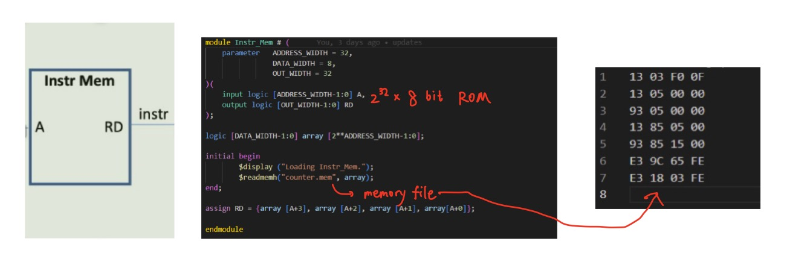
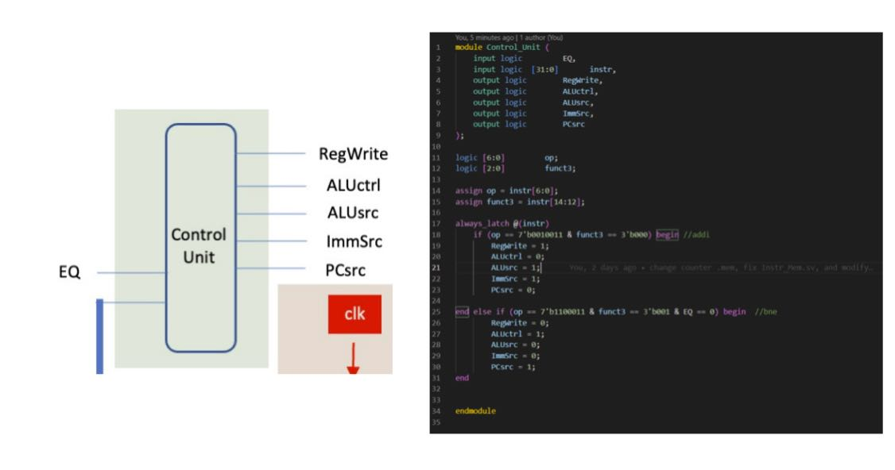
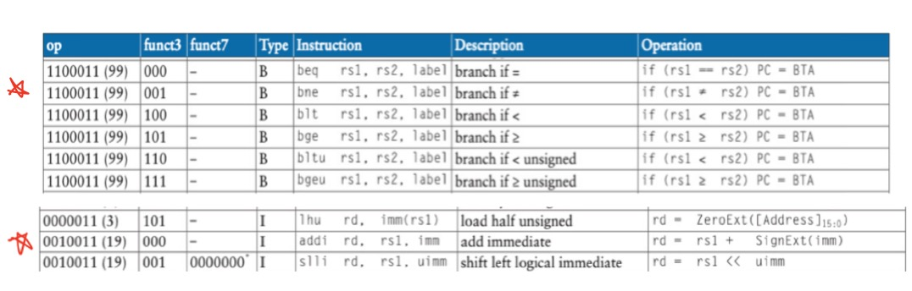

# Lab 4 #
**Guidance**

**Architecture**

**Allocation of tasks**

**Group Agreements**

* All inputs/output names will match the diagram exactly
* All width definitions will start from 0 (e.g. 8 bits will be [7:0])
* We will constantly be commiting our own changes and add documentation 
* We will design our own submodules within the tasks but Hanbo will add simple combinational blocks like multiplexers in the top-level module

# Task 1: Program Counter and Adders #

# Task 2 : Register File, ALU and MUX #

To complete this task I had to complete two steps:
* Creating a register file
* Creating the ALU module

## Step 1: Register File ##
Using the ram2ports as inspiration:

I created the following module:

Main additions were:
* a0 output
* Asynchronous read port vs Synchronous write port (as required in the specification)

## Step 2: ALU Module ##

# Task 3 : Control Unit, Sign-extension Unit and Instruction Memory #

To complete this task I had to complete two steps:
* Creating a instruction memory module and proper memory file
* Creating the Sign extension module
* Creating Control Unit module

## Step 1: Instrution memory module

Similar to a ROM we create in Lab2

The instruction memory module is a ROM with 32 bit address width and 8 bit data width. Inside the module, instrution is stored.
The instrction is 32 bits while the memory is byte width memory, so each instruction takes 4 addresses.
The output combines 4 * 8 bits data, so that a 32 bits data is outputed
The counter.mem file stores the instructions and was loaded into the memory module
The counter that drives the address should increase by 4 every cycle.

## Step 2: Sign extension module

The module extend the Immdiate value in an instruction from 12 bits to 32 bits so that ALU module can process the data.
20 bits of 1/0 is added in front of the immediate

* note: The immediate is located differently in bne and addi, so ImmSrc is used to determine how to extract immediate from instr.

## Step 3: Control Unit module

This module is like a decoder that outputs 5 one bit control signals.
In this experiment, only two instruction is used. The five control signals change according to the opcode and funct3.

# Task 4: Top-Level Module, Testbench and Verification of Design #

# Challenges #
